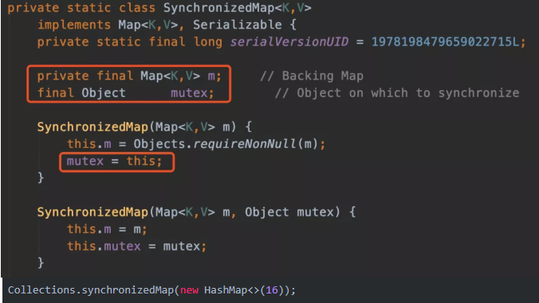
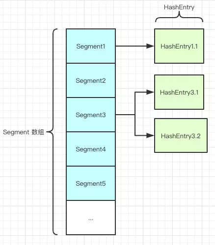
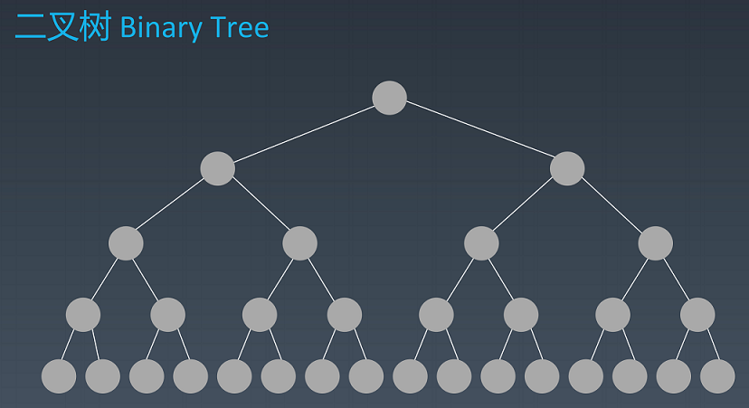
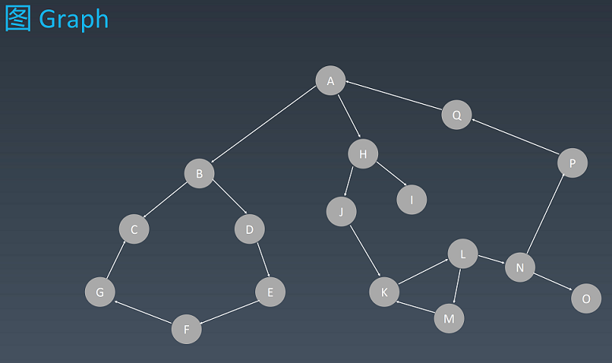
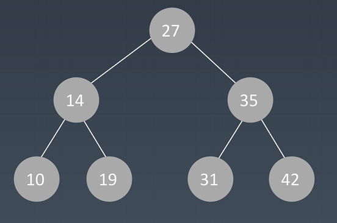
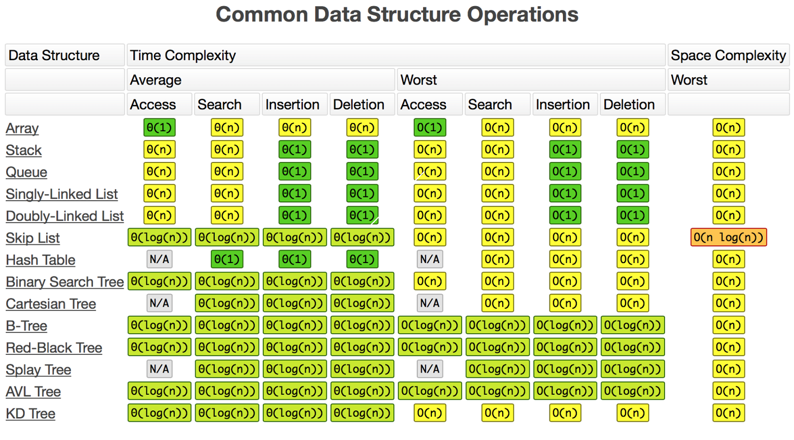
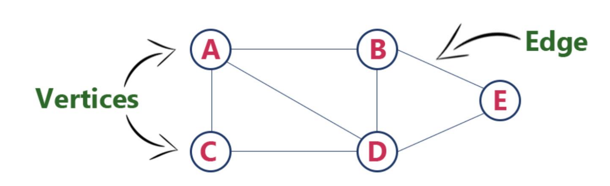

# 第二周学习总结
## 哈希表
哈希表（Hash table），也叫散列表，是根据关键码值（Key value
）而直接进行访问的数据结构。
它通过把关键码值映射到表中一个位置来访问记录，以加快查找的速度。
这个映射函数叫作散列函数（Hash Function），存放记录的数组叫
作哈希表（或散列表）。

java中常见的哈希表有：
1. ### HashTable
    - 方法全部加锁，线程安全，效率低（已被官方建议不再使用）
    - enumerator迭代器不是fail-fast的
    - Hashtable不接受null键null值
2. ### HashMap 
    - 采用了数组和链表的数据结构，能在查询和修改方便继承了数组的线性查找和链表的寻址修改，数组里面每个地方都存了Key-Value这样的实例，在Java7叫Entry在Java8中叫Node
    - 新的Entry节点在插入链表的时候，java8之前是头插法，在java8之后，都是所用尾部插入了。
    - 默认初始化长度是16，负载因子，默认值0.75f，扩容后长度是原数组的2倍。
    - 线程不安全，允许一个null键，多个null值
    - 通过链表的方式解决hash碰撞的，当发生碰撞时，对象会存储在链表的下一个节点中，java1.8后使用红黑树解决hash冲突
    - 在多线程put的情况下，有可能在容量超过填充因子时进行rehash，因为HashMap为了避免尾部遍历，在链表插入元素时使用头插法（java1.7），多线程的情况下可能造成死循环
    - 迭代器(Iterator)是fail-fast迭代器
    - HashMap的容量都是2的幂次方，是因为可以根据按位与操作来计算余数，比求模要快
    - 可以通过下面的语句进行同步： 
    ```java 
        Map m = Collections.synchronizeMap(hashMap);
    ```
    原理是：在SynchronizedMap内部维护了一个普通对象Map，还有排斥锁mutex，我们在调用这个方法的时候就需要传入一个Map，可以看到有两个构造器，如果你传入了mutex参数，则将对象排斥锁赋值为传入的对象。
    如果没有，则将对象排斥锁赋值为this，即调用synchronizedMap的对象，就是上面的Map, 创建出synchronizedMap之后，再操作map的时候，就会对方法上锁
    
    #### 补充说明： 
        fail-fast：
            也就是“快速失败”，它是Java集合的一种错误检测机制。当多个线程对集合进行结构上的改变的操作时，有可能会产生fail-fast机制。记住是有可能，而不是一定。
            例如：假设存在两个线程（线程1、线程2），线程1通过Iterator在遍历集合A中的元素，在某个时候线程2修改了集合A的结构（是结构上面的修改，而不是简单的修改集合元素的内容），modCount != expectedModCount时
            那么这个时候程序就会抛出 ConcurrentModificationException 异常，从而产生fail-fast机制。
            java.util包下的集合类都是快速失败的
        
        fail-safe:
            这种遍历基于容器的一个克隆。因此，对容器内容的修改不影响遍历。java.util.concurrent包下的容器都是安全失败的,可以在多线程下并发使用,并发修改。常见的的使用fail-safe方式遍历的容器有ConcurrentHashMap和CopyOnWriteArrayList等。
            原理：
            采用安全失败机制的集合容器，在遍历时不是直接在集合内容上访问的，而是先复制原有集合内容，在拷贝的集合上进行遍历。由于迭代时是对原集合的拷贝进行遍历，所以在遍历过程中对原集合所作的修改并不能被迭代器检测到，所以不会触发Concurrent Modification Exception。
            缺点：
            基于拷贝内容的优点是避免了Concurrent Modification Exception，但同样地，迭代器并不能访问到修改后的内容，即：迭代器遍历的是开始遍历那一刻拿到的集合拷贝，在遍历期间原集合发生的修改迭代器是不知道的。
        
3. ### ConcurrentHashMap
    1. #### 1.7 
        
        
       
       如图所示，是由 Segment 数组、HashEntry 组成，和 HashMap 一样，仍然是数组加链表。
       Segment 是 ConcurrentHashMap 的一个内部类，主要的组成如下：
        ```java
         static final class Segment<K,V> extends ReentrantLock implements Serializable {
       
               private static final long serialVersionUID = 2249069246763182397L;
       
               // 和 HashMap 中的 HashEntry 作用一样，真正存放数据的桶
               transient volatile HashEntry<K,V>[] table;
           
               transient int count;
                   // 记得快速失败（fail—fast）么？
               transient int modCount;
                   // 大小
               transient int threshold;
                   // 负载因子
               final float loadFactor;
         }
       ```
       HashEntry跟HashMap差不多的，但是不同点是，他使用volatile去修饰了他的数据Value还有下一个节点next。
       
       原理上来说，ConcurrentHashMap 采用了分段锁技术，其中 Segment 继承于 ReentrantLock。
       
       不会像 HashTable 那样不管是 put 还是 get 操作都需要做同步处理，理论上 ConcurrentHashMap 支持 CurrencyLevel (Segment 数组数量)的线程并发。
       
       每当一个线程占用锁访问一个 Segment 时，不会影响到其他的 Segment。
       
       就是说如果容量大小是16他的并发度就是16，可以同时允许16个线程操作16个Segment而且还是线程安全的。
       
       1.7的问题：基本上还是数组加链表的方式，我们去查询的时候，还得遍历链表，会导致效率很低，这个跟jdk1.7的HashMap是存在的一样问题，所以他在jdk1.8完全优化了。
    
    2. ### 1.8
        抛弃了原有的 Segment 分段锁，而采用了 CAS + synchronized 来保证并发安全性。
        
        跟HashMap很像，也把之前的HashEntry改成了Node，但是作用不变，把值和next采用了volatile去修饰，保证了可见性，并且也引入了红黑树，在链表大于一定值的时候会转换（默认是8）。
        
        #### ConcurrentHashMap在进行put操作的还是比较复杂的，大致可以分为以下步骤：
        
        1. 根据 key 计算出 hashcode 。
        2. 判断是否需要进行初始化。
        3. 即为当前 key 定位出的 Node，如果为空表示当前位置可以写入数据，利用 CAS 尝试写入，失败则自旋保证成功。
        4. 如果当前位置的 hashcode == MOVED == -1,则需要进行扩容。
        5. 如果都不满足，则利用 synchronized 锁写入数据。
        6. 如果数量大于 TREEIFY_THRESHOLD 则要转换为红黑树。
        
        至于为什么用synchronized：
        
            synchronized之前一直都是重量级的锁，但是后来java官方是对他进行过升级的，他现在采用的是锁升级的方式去做的。
            针对 synchronized 获取锁的方式，JVM 使用了锁升级的优化方式，就是先使用偏向锁优先同一线程然后再次获取锁，如果失败，就升级为 CAS 轻量级锁，如果失败就会短暂自旋，防止线程被系统挂起。最后如果以上都失败就升级为重量级锁。
            所以是一步步升级上去的，最初也是通过很多轻量级的方式锁定的
        
        #### ConcurrentHashMap的get操作
        1. 根据计算出来的 hashcode 寻址，如果就在桶上那么直接返回值。
        2. 如果是红黑树那就按照树的方式获取值。
        3. 就不满足那就按照链表的方式遍历获取值。
        
        补充：
        
            CAS ：
                是乐观锁的一种实现方式，是一种轻量级锁，JUC 中很多工具类的实现就是基于 CAS 的。    
                线程在读取数据时不进行加锁，在准备写回数据时，比较原值是否修改，若未被其他线程修改则写回，若已被修改，则重新执行读取流程。
                这是一种乐观策略，认为并发操作并不总会发生。
            解决ABA问题：
                1. 版本号
                2. 时间戳
--- 
## 树和图
   ### 二叉树
   
   ### 图
   
   
   Linked List 是特殊化的 Tree
   Tree 是特殊化的 Graph
         
   代码：
   ```java
    public class TreeNode {
        public int val;
        public TreeNode left, right;
        public TreeNode(int val) {
            this.val = val;
            this.left = null;
            this.right = null;
        }
    }
   ```    

### 二叉树构建
```java
    public List<ListNode> creatTree(int[] arr){
        List<ListNode> nodeList = new LinkedList<ListNode>();
        for (int i = 0; i < arr.length; i++) {
            nodeList.add(new ListNode(arr[i]));
        }
        for (int i = 0; i < arr.length / 2 - 1; i++) {
            nodeList.get(i).left = nodeList.get(i * 2 + 1);
            nodeList.get(i).right = nodeList.get(i * 2 + 2);
        }
        int lastIndex = arr.length / 2 - 1;
        nodeList.get(lastIndex).left = nodeList.get(lastIndex * 2 + 1);
        if (arr.length % 2 == 1){ 
            nodeList.get(lastIndex).right = nodeList.get(lastIndex * 2 + 2);
        }
        return nodeList;
    }
```
### 二叉树的遍历

1. 前序（Pre-order）：根-左-右
```java
public static void preOrderTraverse(ListNode node){
    if (node == null) return;
    System.out.print(node.val + " ");
    preOrderTraverse(node.left);
    preOrderTraverse(node.right);
}
```
2. 中序（In-order）：左-根-右
```java
public static void inOrderTraverse(ListNode node){
    if (node == null) return;
    inOrderTraverse(node.left);
    System.out.print(node.val + " ");
    inOrderTraverse(node.right);
}
```
3. 后序（Post-order）：左-右-根  
```java
public static void postOrderTraverse(ListNode node){
    if (node == null) return;
    postOrderTraverse(node.left);
    postOrderTraverse(node.right);
    System.out.print(node.val + " ");
}
```
     
### 二叉搜索树 Binary Search Tree



二叉搜索树，也称二叉排序树、有序二叉树（Ordered Binary Tree）、排
序二叉树（Sorted Binary Tree），是指一棵空树或者具有下列性质的二叉
树：
1. 左子树上所有结点的值均小于它的根结点的值；
2. 右子树上所有结点的值均大于它的根结点的值；
3. 以此类推：左、右子树也分别为二叉查找树。 （这就是 重复性！）

中序遍历：升序排列
   
### 复杂度分析

       
    
### 图
  
  
  #### 图的属性
  - Graph(V,E)
  - V - vertex: 点
    1. 度 - 入度和出度
    2. 点与点的距离：联通与否
    
  - E - edge：边
    1. 有向和无向（单行线）
    2. 权重（边长）
  
  
  
    